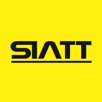

# Miguel Carvalho Soares

## Introdução

Olá! Sou Miguel Carvalho Soares, ingressante do segundo semestre de 2022 na [Faculdade de Tecnologia de São José dos Campos - Prof. Jessen Vidal](https://fatecsjc-prd.azurewebsites.net/). Minha paixão pela computação foi despertada durante o curso técnico de informática, onde descobri a satisfação em resolver problemas complexos e criar sistemas como desafiadores quebra-cabeças.

Ao adotar o inovador método de Aprendizado por Projeto Integrado da FATEC, mergulhei em experiências enriquecedoras de trabalho em equipe. Mais do que apenas aprimorar minhas habilidades técnicas, percebi que a verdadeira essência desse aprendizado está na construção de Soft Skills para colaboração eficaz em grupo.

Minha busca incessante pelo próximo nível me conduz a um objetivo claro: ser um cientista de dados renomado. Acredito que as sólidas bases formadas na FATEC e as experiências valiosas nos projetos de NetWorkings me aproximam cada vez mais dessa aspiração.

Vamos explorar juntos essa jornada onde cada desafio é uma oportunidade de crescimento, e onde a construção de soluções inovadoras é a verdadeira essência da minha paixão pela computação.

## Meus Projetos

## :heavy_check_mark: Em 2023-2

### Parceiro Acadêmico
[SIATT](https://www.siatt.com.br/siatt/)

## :bookmark_tabs: Sobre o projeto

Nossa parceira, a empresa Siatt, enfrenta o desafio de gerenciar eficazmente seus projetos estratégicos em um cenário de complexidade, apresentamos uma solução abrangente e flexível, um Sistema de Gerenciamento de Times para Projetos Complexos. Esse sistema foi projetado para atender às necessidades específicas da Siatt, permitindo tanto um macro gerenciamento quanto um micro gerenciamento dos projetos.

### :warning: Dificuldades

> _Contratempos que afetam a eficiência operacional, a comunicação eficaz e a capacidade de monitorar o progresso dos projetos e suas etapas em tempo real. Estes desafios incluem dificuldade de gestão apropriada e um acompanhamento adequado dos projetos, juntamente com uma interface de usuário pouco amigável e problemas relacionados à integridade dos dados._

### :white_check_mark: Proposta de Solução

> _Um software especializado que permita importar dados de projetos em andamento a partir de arquivos Excel, para facilitar a migração de dados e a transição para um novo sistema de gerenciamento. A partir disso, o Engenheiro Chefe pode atribuir pacotes de trabalho e observar cada mudança do projeto e seus pacotes, subpacotes e tarefas. Melhorando a organização, o acompanhamento em tempo real e a colaboração entre as diferentes etapas do projeto. Já os Líderes de Projeto, têm acesso individual apenas aos seus Pacotes, podem gerenciá-los e acompanhar o andamento. De forma intuitiva, amigável e de usabilidade alta._

### Contribuições pessoais

### Hard Skills

- Desenvolvimento API com Java e Spring Boot: Possuo habilidade autônoma nesta área;
- Desenvolvimento de desing e estilização para o FrontEnd: Posso realizar com suporte;
- Desenvolvimento de Funcionalidades de FrontEnd: Possuo habilidade autônoma nesta área;
- Metodologia Ágil SCRUM: Possuo habilidade autônoma nesta área;

### Soft Skills

- Flexibilidade: Demonstrei notável adaptabilidade ao ingressar na equipe no meio do projeto. Rapidamente me integrei, compreendendo o contexto existente e ajustando-me às dinâmicas já estabelecidas. Essa capacidade de adaptação permitiu uma transição suave, assegurando a continuidade eficiente do trabalho em andamento.
- Proatividade: Buscava ativamente realizar tarefas e antecipar potenciais desafios, assegurando uma abordagem preventiva para manter a eficiência operacional.
- Trabalho em equipe: Valorizo a colaboração em uma equipe de 9 membros, onde cada integrante compreende claramente o seu papel, promovendo um ambiente de trabalho coeso e eficiente.
- Pensamento Crítico: Exerci o pensamento crítico ao analisar situações complexas, avaliar diferentes perspectivas e tomar decisões fundamentadas para solucionar desafios de forma eficaz. 

### Principal Ponto de Aprendizado

- Desenvolvi adaptabilidade ao me integrar a uma forma de trabalho já estabelecida ao entrar na equipe durante o projeto. Além disso, aprimorei a habilidade de fornecer feedback de maneiras diversas para melhor atender às necessidades da equipe.

## 🛠️ Tecnologias

Linguagens, bibliotecas e tecnologias usadas na construção do projeto:

[GIT NINE-TECH](https://github.com/Nine-Tech)